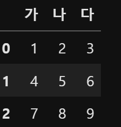
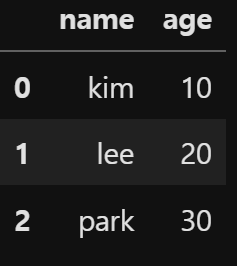

- python -m venv venv : 가상환경 생성
- siurce venv/Scripts/avtivate : 가상환경 활성화
- pip <module_name> : 모듈 설치
- pip freeze >> requirementes.txt : 현재 설치된 모듈 리스트 저장
- pip install -r requirements.txt : requirements.txt 기준으로 모듈 설치

## 00.numpy🧸
- 🐰 numpy불러오기 `import numpy as np`
- 🐰 np.arange 
    - 정렬 
        ```python
        print(np.arange(10))
        # [0 1 2 3 4 5 6 7 8 9]
        ```
- 🐰 np.array
     - 다차원 배열 생성
        ```python
            my_matrix = np.array([[1, 2, 3], [4, 5, 6]])
            # [[1 2 3]
             #   [4 5 6]]
         ```   
- 🐰 ndarray 자료형
     - `arr1 = np.array([1, 2, 3], dtype = np.float64)` 타입을 지정할 수 있음

    - `.astype(np.float64)` 형변환을 시키는 함수
    - `.dtype` 형을 확인하는 함수
    -  파이썬과 달리 직접 계산 가능
        - ```python
            data = 
            [[   1.     1.2    3. ]
            [-123.   123.     0. ]]
            print(data * 10)  #  [   10.    12.    30.]
            print(data + data ) # [   2.     2.4    6. ]
            ```
    - 비교도 가능
        - ```python
            print(arr > arr2)
            # [[False False  True]
             #   [ True  True  True]]
            print(arr == 3)
            # [[False False  True]
             #   [False False False]]
            ```
- 🐰 인덱싱과 슬라이싱
    - `arr = np.arange(10)`
        - `print(arr[7])` # 7
        - `print(arr[2:5])` # [2, 3, 4] # 파이썬과 달리 원본도 바뀜
    - 이차원 배열을 확인하려면 
        - `arr = np.array([[1, 2, 3], [4, 5, 6]])`
            - [[1 2 3]
                -  [4 5 6]]
            - `print(arr[0])` # [1, 2, 3]
            - `print(arr[1][1])` # [5]
            - `print(arr [1, 1])` # [5]
    - 삼차원 배열을 확인하려면
        - `arr3d = np.array([[[1, 2, 3], [4, 5, 6], [7, 8, 9]], 
            [[11, 12, 13], [14, 15, 16], [17, 18, 19]], 
            [[11, 22, 33], [44, 55, 66], [77, 88, 99]]])`
            - `print(arr3d[2][0][1])` # 22
            - `print(arr3d [2, 0, 1])` # 22
            - `print(arr3d[:1])` # [[[1 2 3] [4 5 6] [7 8 9]]]
            - `print(arr3d[:1, 1:, 2:])` # [6] [9]
        - 인덱스로 데이터 값 바꾸기
            - `arr3d[0, 1:, 2:] = 9999` # [6] -> [9999], [9] -> [9999]

- 🐰 불리언 값으로 선택
    -  `names = np.array(['hong', 'kim', 'hong', 'kim'])`
        - 'hong'의 데이터만 추출하고 싶을 때
            - `names == 'hong'` # array([ True, False,  True, False]) 
            - `data = np.array([['math', 60], ['math', 90], ['eng', 70], ['eng', 50]])`
                - `data[names == 'hong']` # ['math', '60'], ['eng', '70'] # data[[True, False, True, False]]에서 True만 출력한것
                - `data[names == 'hong', :1]` # ['math'], ['eng'] 

- 🐰 fancy indexing
    - `np.zeros((8, 4))` 
        - 
            [[0. 0. 0. 0.]
            [0. 0. 0. 0.]
            [0. 0. 0. 0.]
            [0. 0. 0. 0.]
            [0. 0. 0. 0.]
            [0. 0. 0. 0.]
            [0. 0. 0. 0.]
            [0. 0. 0. 0.]]
     - ```python
        for i in range(8):
        arr[i] = i # arr[1] = 1
        print(arr) 
        # [[0. 0. 0. 0.]
        #   [1. 1. 1. 1.]
        #   [2. 2. 2. 2.]
        #   [3. 3. 3. 3.]
        #   [4. 4. 4. 4.]
        #   [5. 5. 5. 5.]
        #   [6. 6. 6. 6.]
        #   [7. 7. 7. 7.]]
        ```
    - `arr[[4, 3, 0, 5]]` # [[]] 내가 원하는 특정 데이터에 접근
        - 
            array([[4., 4., 4., 4.],
                [3., 3., 3., 3.],
                [0., 0., 0., 0.],
                [5., 5., 5., 5.]])
        - `arr[[-3, -5, -1]]`
            -  
                array([[5., 5., 5., 5.],
                [3., 3., 3., 3.],
                 [7., 7., 7., 7.]])
    - `reshape()`
        - `arr = np.arange(32).reshape(8, 4)` 
            - 
                [[ 0  1  2  3]
                [ 4  5  6  7]
                [ 8  9 10 11]
                [12 13 14 15]
                [16 17 18 19]
                [20 21 22 23]
                [24 25 26 27]
                [28 29 30 31]]
            - `print(arr[[1, 5]])`
                - 
                    [[ 4  5  6  7]   # 배열의 1,5번째만 출력
                     [20 21 22 23]]

            - `print(arr[[1, 5], [2, 3]])`
                - 
                    [ 6 23]  # 배열의 1, 5번쨰 중에서 1번 배열의 2번째, 5번 배열의 3번쩨
            - `arr[[1, 5]][:, [2, 3]]` 
                - 
                    array([[ 6,  7],
                     [22, 23]]) # 배열의 1번째, 5번째 / 처음부터 끝까지에서 2,3번째 고르기
- 🐰 배열 전치
    - `arr.T` 축을 바꿀 때

- 🐰 numpy 함수
    - `np.random.standard_normal(size = (3, 3))` 
        - 3 * 3 배열을 임의로 만들 때
    - `np.sqrt()`
        - 배열에 루트를 씌울 때
    - ` np.abs()`
        - 절댓값을 씌울 때
    - `np.isnan()`
        - 현재 배열에 nan이 들어있는지 확인
---

## 01.datastructure🧸
- 🐰 Series
    - pandas에서 사용하는 1차원 배열
    - index를 사용할 수 있음
    - `arr = np.arange(100, 110)`
        - `s = pd.Series(arr)`
            - 
                0    100
                1    101
                2    102
                3    103
                4    104
                5    105
                6    106
                7    107
                8    108
                9    109 # 인덱스에 접근 하게 만듦

    - [-1] ❌ # 음수인덱스는 적용안됨
    - `names = pd.Series(['kim', 'lee', 'park'], index=['a', 'b', 'c'])` # index=list('abc')도 가능
        - 인덱스를 내가 직접 지정할 수 있음
        -  `names['a']` # 'kim'
        - ` names.values` # array(['kim', 'lee', 'park'], dtype=object)
        - `names.ndim` # 1 몇 차원인지
        - `names.shape` # (3, ) 1차원이여서 총 데이터 개수만 보여줌
- 🐰 fancy indexing
    - 
        `f = ['banana', 'apple', 'grape', np.nan]`
        ` s= pd.Series(f, index=list('abcd'))`
        s = a    banana
            b     apple
            c     grape
            d       NaN
        - s[['d']] # d       NaN
        - s.iloc[[3]] # d       NaN
        - s['a':'b'] # 글자로 된 index는 b도 포함되서 나옴옴
- 🐰 결측치(nan)처리
    - `isnull()` 
        - `nan`이 포함되면 True
    -   `s[s.isnull()]`
         - `s`배열에서 `nan`이 포함된 행만 출력
    - `s[s.notnull()]`
        - `s` 배열에서 `nan`이 포함되지 않은 행만 출력
    
- 🐰 DataFrame
    - 2차원 데이터 구조
    - 행, 열 구조
    - `pd.DataFrame()`
         -  # 이런식으로 나옴
    - 
         ```python
          pd.DataFrame([
             [1, 2, 3],
             [4, 5, 6],
             [7, 8, 9]
            ], columns=['가', '나','다'])
        ```
      -  # columns를 넣으면 위에 값이 바뀜

    - dict형태
        - 
            ```python
                     info = {
                     'name': ['kim', 'lee', 'park'],
                      'age': [10, 20 ,30],}
                     pd.DataFrame(info)
            ```
        
      
    - index 지정
        - `info_df.index = list('abc')`
    - 내가 필요한 column만 고르기
      - -`info_df[          ['age', 'name']       ]`

## 02.file_load_save🧸     
- 🐰 excel
    - excel 데이터 불러오기 
        - `pd.read_excel('data/DAMF2.xlsx')` ()안에 원하는 엑셀 주소 입력
- 🐰 csv
    - csv 데이터 불러오기
      - `pd.read_csv('data/DAMF2.csv')` ()안에 원하는 csv주소 입력

## 03.query🧸
- 🐰 seaborn
    - `import seaborn as sns`
    - `df = sns.load_dataset('titanic')` ()안에 원하는 데이터 이름

- 🐰 head(), tail()
    - `.head()` # 앞에서 다섯번째 데이터까지
    - `.tail()` # 뒤에서 다섯개의 데이터
    - `.head(10)` # ()안에 내가 보고싶은 데이터 개수를 적을 수 있음

-   🐰. info()
    - 데이터의 정보를 볼 수 있음

- 🐰 .value_counts()
      - ` df['who'].value_counts()` 앞에 원하는 값을 넣으면 특정값이 얼마나 자주 나오는지 알 수 있음
      - 

         who
         man      537
         woman    271
         child     83

- 🐰 정렬
    - `sort_index(ascending=False)`
        -  ascending = false로 해서 내림차순으로 정렬
    - `sort_values()`
        - `df.sort_values('age')` 
            - ()안에 내가 원하는 value값을 넣고 정렬하면 오름차순으로 정렬 됨
            - 이경우에는 나이가 어린순으로 정렬
        - ()안에 []로 value값을 여러개 적을 수 있음

- 🐰 indexing, slicing, 조건 필터링
    -   `df.loc[3, ['pclass', 'who']]` # 처음엔 인덱스 번호, 두번째는 colnum
    - 특정 값의 데이터프레임 보기
        - 처음엔 `df['who'] == 'man'` 로 T, F만 나오게 하기
        - 두번째로 `condition = df['who'] == 'man'` 로 변수에 저장하기
        - 세번째로 df[condition] 으로 데이터 프레임 불러오기
    -  ` cond1 = df['fare'] > 30` 이런식으로 조건도 가능
    - `df.loc[cond1 & cond2]` # 두가지 조건을 다 걸 떄 (and)
    - `df.loc[cond1 | cond2]` # 둘 중 하나라도 맞을 때 (or)

-  🐰 `.isin()`
    - `df['embarked'].isin(['Q', 'S'])` # embarked가 S 또는 Q인 사람들만 불러오기 

## 04.statistics🧸
- 🐰 `describe()` 
    - df의 여러가지 값들을 나타내는 함수
- 🐰 `count()`
    - 데이터의 개수를 세는 함수
- 🐰 `mean()`
    - 데이터의 평균을 나타내는 함수
- 🐰 `numeric_only=True`
    - nan을 건너띄고 숫자만 계산하고 싶을 떄
    - `df.mean(numeric_only=True)`
- 🐰 `median()`
    - 중앙값
- 🐰 `.var()` 분산
- 🐰 `.std()` 표준편차
- 🐰 `.agg()` aggregaition
    - `df['age'].agg(['max', 'min', 'mean', 'count'])` # 여러개의 값을 보고 싶을 때
- 🐰 `.quantile(0)`
    - `.quantile(0.1)` # 나이기준 하위 10%를 찾음
    - `df['age'].quantile(0.8)` # 하위 20%를 찾음
- 🐰 `.unique()` 
    - `df['who'].unique()` 
        - 고유값만 출력 # array(['man', 'woman', 'child'], dtype=object)
- 🐰`.mode()`
    - 가장 많이 등장한 데이터 
    - `df['who'].mode()` # 0    man
- 🐰`corr()`
    - 각 칼럼끼리의 상관관계를 표현

## 05.missing_values🧸
- 🐰 `.copy()`
    - 원본은 그래로 두고 복사본을 새로 만듦
    - 데이터 프레임을 수정할 때 주로 사용

- 🐰 결측치
    - 1. 결측 데이터 확인
        - `.isnull().sum()` nan 데이터만 출력
    - 2. 결측치가 아닌 데이터 확인인    
        - `.notnull().sum()` 비어있지 않은 데이터만 출력
    - 3. 결측치 채우기
        - `df_copy.loc[cond, 'age']  = 30` 
            - nan이였던 데이터를 30으로 바꿈
        - `.fillna()`
            - `df_copy['age'].fillna(100)` 
            - 위에서 했던거를 한번에 처리
            - 직접적으로 수정하지는 않고 결과만 보여줌
            - 원본파일도 수정하고 싶다면 재할당 해주기
            - deck은 A, B, C, D, E, F, G의 카테고리가 있음
            - 만약 카테고리에 없는 Z를 결측치에 채우고 싶다면
            -  `df_copy['deck'].cat.add_categories('Z')`로 카테고리에 Z를 추가해주기
    - 4. 결측치 데이터 지우기
        - `.dropna()`
            - `nan`값이 있는 데이터를 다 지워줌
         
## 06.preprocessing🧸
- 🐰 컬럼추가
    - `df_copy['family'] = df_copy['sibsp'] + df_copy['parch']`
        - 새로운 칼럼에 값들을 더해서 추가 할 수도 있음
    - `df_copy['gender'] = df_copy['sex'] + '-' + df_copy['who']`
        - value값에 '-'가 추가돼서 나옴옴

- 🐰 행 삭제
    - `.drop()`
        - ()안에 내가 원하는 인덱스 번호를 넣기
        - 원본에는 반영되지 않기 때문에 재할당 해줘야 함
    - axis=0 → 행(row) 삭제


- 🐰 열 삭제
    - `.drop('colnum_name', axis = 1 )` 
    - axis=1 ->열(column) 삭제

- 🐰 `pd.to_numeric()`
    - 문자열을 숫자로 변환하는 함수
    - 데이터 정제할 때 잘못된 값이 섞여 있을 경우 유용함
    - `errors='coerce'`를 사용하면 변환 불가능한 값 → NaN

- 🐰`pd.cut()`
    - 연속형 데이터를 구간별로 나누는 함수
    - 고정된 구간으로 나눔(데이터 개수 다를 수 있음음)
    - ` bins = [0, 100, 200, 300, df_copy['운동량'].max()]`
        - `bins`는 구간을 나누는 기준 값
        - 0 ~ 100, 100 ~ 200, 200 ~ 300, 300 ~ max값으로 나눔눔 
    - `pd.cut(df_copy['운동량'], bins). value_counts()`
        - pd.cut을 사용해 각 데이터가 어느 구간에 속하는지 나눔
        - `.value_counts()`를 사용해 각 구간에 속하는 데이터 개수를 계산

- 🐰 `pd.qcut()`
    - **동일한 개수로** 구간을 나누는 함수
    - ✔ pd.cut()과 달리, 각 구간에 데이터 개수가 비슷하도록 자동 분할
    - `pd.qcut(df_copy['운동량'], q=10)` 
        - `q` > 나눌 분위수 개수 (10분위로 나눈다)

## 07.group🧸
- 데이터를 특정 기준으로 그룹화하여 연산할 수 있게 해주는 함수
- ✅ `groupby()` 기본 개념
    - df.groupby(기준컬럼).집계함수()
        - 기준컬럼 > 그룹을 나눌 기준
        - 집계함수 >  그룹별 연산 수행
        - `df_copy.groupby(['sex', 'pclass']).mean(numeric_only = True)` # sex와 pclass의 평균치 보기
- 🐰 `reset_index()`
    - 인덱스를 초기화하고, 기존 인덱스를 컬럼으로 변환하는 함수
-  🐰 `pivot_table`
    - 데이터를 그룹화하고, 원하는 값들을 집계해서 새로운 표로 정리하는데 유용
    - 
        ```python
            df.pivot_table(index='행으로 정리할 열', 
               columns='열로 정리할 열', 
               values='계산할 값', 
               aggfunc='집계 함수')
        ```


## 08.concat🧸  
- 데이터 프레임 연결
- 🐰 `pd.concat([sales1, sales2], axis=1)` 
    - # concat으로 데이터 프레임 연결
- 🐰 `merge()`

## 09.titanic🧸
- 데이터는 몇개의 행과 열로 이루어져 있는지 확인
    - `df.shape`
- 생존자와 사망자의 분포를 확인해 주세요
    - `df['survived'].value_counts()`

- 성별, pclass 별 생존자 합계(sum)를 출력 하세요
    - pivot_table()를 사용합니다.
    - `df.pivot_table(index = ['sex'], columns =['pclass'], values = 'survived', aggfunc =['sum', 'mean'])`

- 인덱스 초기화 reset_index(), 생존율 내림차순 정렬
    - `cond.reset_index()` 인덱스 초기화
    - `df_2.sort_values(('mean'), ascending = False, ignore_index = True)` 평균값으로 내림차순 하고 인덱스 번호 무시해서 0번부터 정렬하게 하기

- child의 나이는 몇 세부터 몇 세까지 정의되었는지 확인
    - `df.loc[df['who'] == 'child', 'age'].agg(['min', 'max'])

- 등급별(pclass) / 연령별(who) 평균 요금 비교
    - **단일 대괄호 ['fare']**는 Series로 선택하고, 결과도 Series 형태로 나온다.
    - **이중 대괄호 [['fare']]**는 DataFrame으로 선택하고, 결과도 DataFrame 형태로 나온다.

- fare 요금 기준 상위 10% 기준 요금 확인
    - df['fare'].quantile(0.9)

- 부자의 데이터 개수와 생존율 확인
    - `df.loc[df['fare'] >= 77.9583]['survived'].agg(['count', 'mean'])`
- 생존자의 평균 나이와 사망자의 평균 나이 비교
    - `df.groupby(['survived'])['age'].mean()`
- ~별은 `.groupby()` 조건이 있으면 `.loc`
